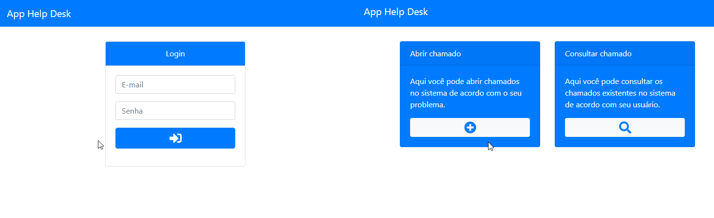

# Aplicação Helpdesk
> Uma aplicação web capaz de abrir e consultar chamados de Helpdesk.

Este projeto é uma aplicação web capaz de autenticar usuários em um sistema de Helpdesk. Os usuários de nível comum conseguem adicionar e consultar chamados (apenas os feitos por ele mesmo) e usuários de nível técnico conseguem ver todos os chamados registrados no sistema.

### Exibição - Login de usuário/Página inicial

### Exibição - Abrir chamados/Consultar chamados

