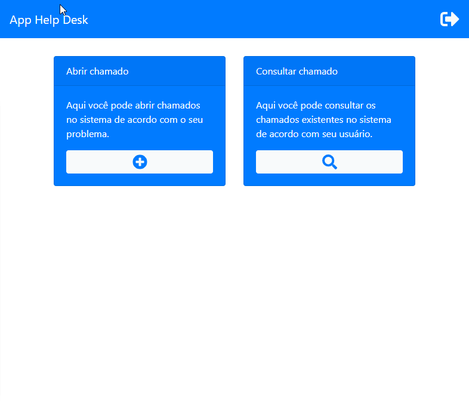

# Aplicação Helpdesk
> Uma aplicação web capaz de abrir e consultar chamados de Helpdesk.

Este projeto é uma aplicação web capaz de autenticar usuários em um sistema de Helpdesk. Os usuários de nível comum conseguem adicionar e consultar chamados (apenas os feitos por ele mesmo) e usuários de nível técnico conseguem ver todos os chamados registrados no sistema.

### Exibição - login de usuário/página inicial


### Exibição - abrir chamados/consultar chamados


### Exibição - aplicação em funcionamento


## Instalação

Para executar o projeto localmente o repositório deve ser clonado da forma desejada:
```
$ git clone https://github.com/app_helpdesk.git
```

## Histórico de atualização 

* 0.0.1;
    * Lançamento inicial.

## Meta 

Jonathan Douglas Nunes de Souza - [@jonathansouza] - <jonathannunes.souza98@gmail.com>

Distribuido sob licença. Veja **`LICENÇA`** para mais informações.

[https://github.com/jonathannunesdsouza/jonathannunesdsouza.github.io]